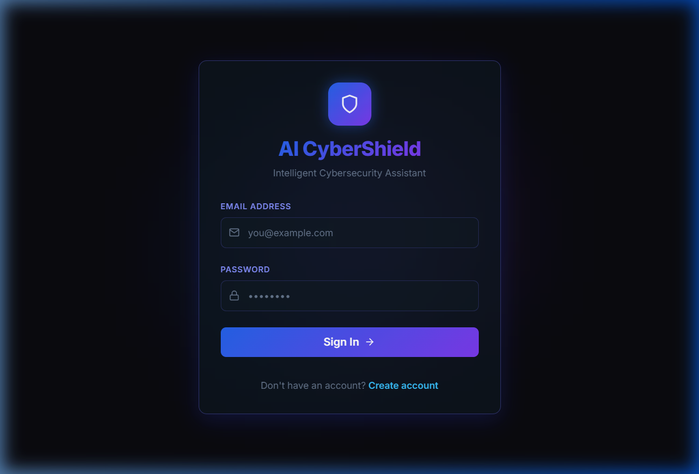
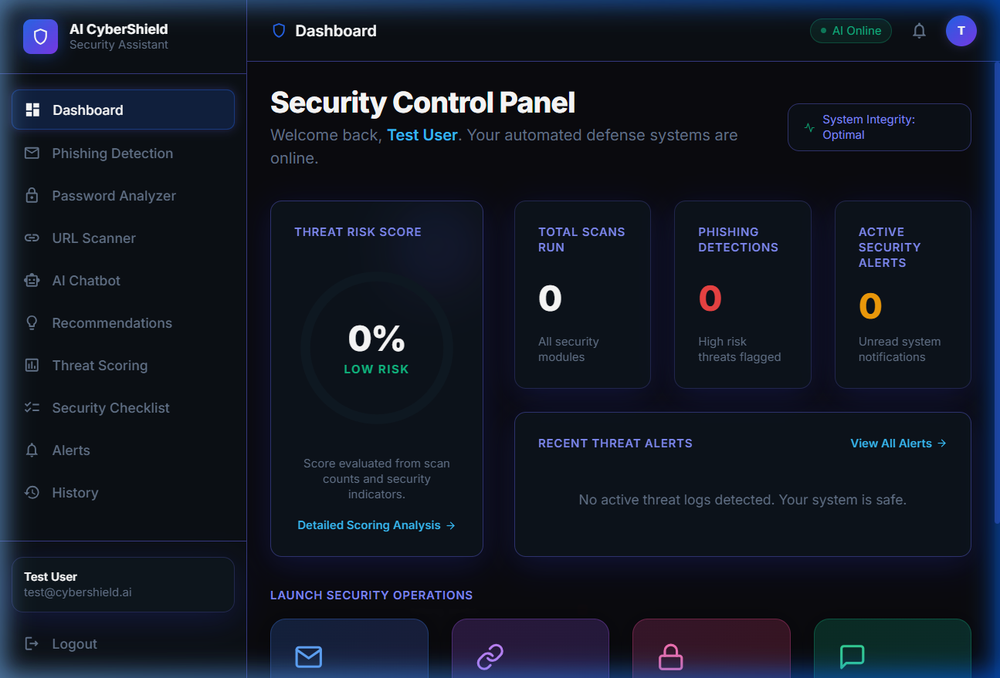
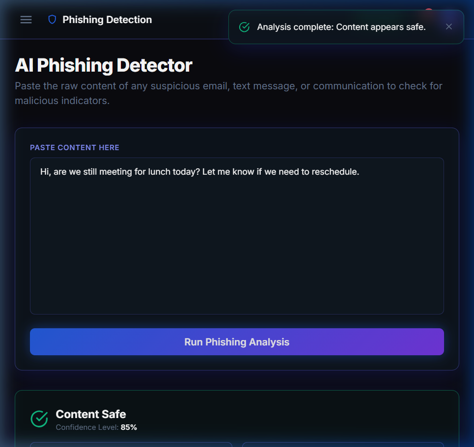
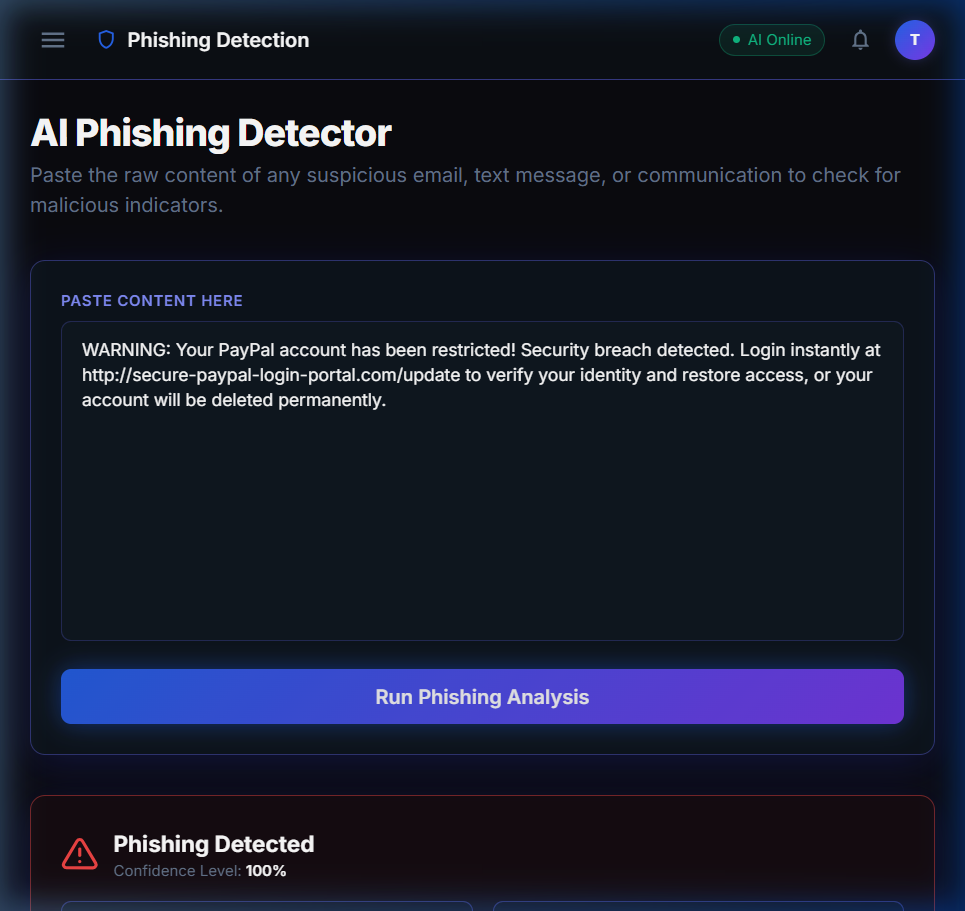
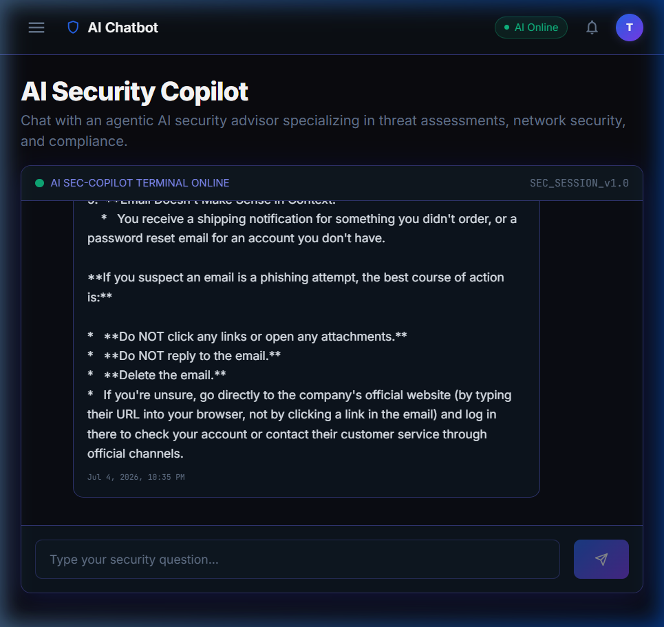
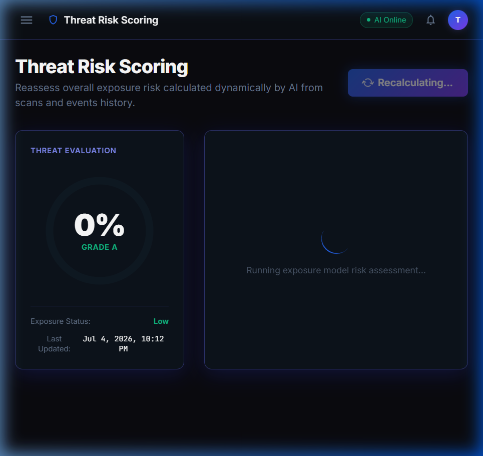

# AI CyberShield – Agentic AI Powered Intelligent Cybersecurity Assistant

> **"Your Personal AI Cybersecurity Assistant — Protecting You 24/7."**

AI CyberShield is an Agentic AI-powered intelligent cybersecurity assistant designed to help students, professionals, and small businesses detect phishing attacks, analyze password strength, identify suspicious URLs, and receive personalized cybersecurity recommendations. Powered by the Google Gemini API and automated using n8n workflows, the system provides real-time threat analysis, exposure scoring, and security awareness assistance through an intuitive web application.

## 🌐 Live Demo

> ✅ **The app is fully deployed and accessible from any device — no installation required!**

| Service | URL |
|---------|-----|
| 🖥️ **Frontend App (Vercel)** | [https://ai-cyber-shield-black.vercel.app](https://ai-cyber-shield-black.vercel.app) |
| 🖥️ **Frontend App (Render)** | [https://ai-cybershield-frontend.onrender.com](https://ai-cybershield-frontend.onrender.com) |
| ⚙️ **Backend API** | [https://ai-cybershield-vwls.onrender.com](https://ai-cybershield-vwls.onrender.com) |
| 📖 **API Docs (Swagger)** | [https://ai-cybershield-vwls.onrender.com/api/docs](https://ai-cybershield-vwls.onrender.com/api/docs) |

> 💡 Open the frontend link on **any mobile, tablet, or PC** to use the full application instantly.


# 📸 Screenshots

## 1. User Authentication (Login)


---

## 2. Dashboard


---

## 3. AI Phishing Detector

### Safe Input


### Suspicious Input


---

## 4. AI Cybersecurity Chatbot


---

## 5. Threat Risk Scoring Dashboard


---

# 🚀 Technology Stack

## Frontend

- React
- Vite
- Tailwind CSS
- React Router
- Axios
- Framer Motion
- React Icons

## Backend

- FastAPI
- SQLAlchemy
- Alembic
- JWT Authentication
- Passlib (Bcrypt)
- Pydantic

## Database

- Neon PostgreSQL

## Artificial Intelligence

- Google Gemini API

## Workflow Automation

- n8n Community Edition

## Deployment

- Vercel
- Render
- GitHub

---

# ✨ Features

- User Authentication
- AI Phishing Detection
- Password Strength Analyzer
- Suspicious URL Scanner
- AI Cybersecurity Chatbot
- Personalized Security Recommendations
- Threat Risk Scoring
- Security Checklist Generator
- Real-Time Alerts
- User Activity History
- n8n Workflow Automation

---

# 📂 Project Structure

```text
AI-CyberShield/
│
├── frontend/
│   ├── public/
│   ├── src/
│   │   ├── api/
│   │   ├── components/
│   │   ├── contexts/
│   │   ├── pages/
│   │   ├── router/
│   │   ├── utils/
│   │   └── index.css
│   ├── tailwind.config.js
│   ├── vite.config.js
│   └── package.json
│
├── backend/
│   ├── app/
│   │   ├── api/
│   │   ├── core/
│   │   ├── models/
│   │   ├── schemas/
│   │   ├── services/
│   │   └── main.py
│   ├── alembic/
│   ├── tests/
│   ├── requirements.txt
│   └── Procfile
│
├── n8n/
│   ├── phishing_alert_workflow.json
│   ├── email_notification_workflow.json
│   └── threat_report_workflow.json
│
├── docs/
│
├── screenshots/
│
├── README.md
└── .gitignore
```

---

# ⚙️ Environment Variables

## Frontend (`frontend/.env`)

```env
VITE_API_BASE_URL=http://localhost:8000/api/v1
```

## Backend (`backend/.env`)

```env
DATABASE_URL=YOUR_NEON_DATABASE_URL
SECRET_KEY=YOUR_SECRET_KEY
ALGORITHM=HS256
ACCESS_TOKEN_EXPIRE_MINUTES=30
GEMINI_API_KEY=YOUR_GEMINI_API_KEY
N8N_WEBHOOK_URL=YOUR_N8N_WEBHOOK_URL
FRONTEND_URL=http://localhost:5173
```

---

# 💻 Running the Application

## Prerequisites

- Node.js (v20 or later)
- Python (v3.12 or later)
- Neon PostgreSQL Database
- Google Gemini API Key
- n8n Community Edition

---

## Backend Setup

```bash
cd backend

python -m venv venv

# Windows
venv\Scripts\activate

# macOS/Linux
source venv/bin/activate

pip install -r requirements.txt

alembic upgrade head

uvicorn app.main:app --reload
```

Backend URL

```
http://localhost:8000
```

Swagger Documentation

```
http://localhost:8000/docs
```

---

## Frontend Setup

```bash
cd frontend

npm install

npm run dev
```

Frontend URL

```
http://localhost:5173
```

---

# 🤖 AI Modules

### AI Phishing Detector

Analyzes:

- Emails
- SMS Messages
- WhatsApp Messages

Returns:

- Safe
- Suspicious
- Dangerous

---

### Password Strength Analyzer

Checks:

- Password Length
- Complexity
- Symbols
- Numbers
- Uppercase
- Lowercase

Provides AI-generated recommendations.

---

### URL Scanner

Detects:

- Suspicious URLs
- Shortened Links
- Phishing Domains

Provides a risk score and explanation.

---

### AI Cybersecurity Chatbot

Powered by Google Gemini API.

Answers cybersecurity questions including:

- Phishing
- Malware
- Password Security
- Social Engineering
- Safe Browsing
- Online Privacy

---

# 🔄 n8n Workflow Automation

Included Workflows:

- Email Phishing Detection
- Threat Alert Notification
- Password Analysis
- URL Analysis
- Security Checklist Generation
- Weekly Security Reports

---

# 🌐 Deployment

## Backend — Live on Render

🔗 **Live URL**: [https://ai-cybershield-vwls.onrender.com](https://ai-cybershield-vwls.onrender.com)

Build Command

```bash
pip install -r requirements.txt
```

Start Command

```bash
uvicorn app.main:app --host 0.0.0.0 --port $PORT
```

---

## Frontend — Live on Render Static Sites

🔗 **Live URL**: [https://ai-cybershield-frontend.onrender.com](https://ai-cybershield-frontend.onrender.com)

Set environment variable on Render:

```env
VITE_API_BASE_URL=https://ai-cybershield-vwls.onrender.com/api/v1
```

---

## Database

Use **Neon PostgreSQL**

Configure the `DATABASE_URL` environment variable.

---


# 📈 Future Scope

- Browser Extension
- Android Application
- iOS Application
- Multi-Language Support
- AI Threat Intelligence
- Cloud Security Monitoring
- Enterprise Dashboard
- Advanced Threat Analytics

---

# 👨‍💻 Developer

**Prakash Salvi**

Yadavrao Tasgaonkar Institute of Engineering and Technology

Department of Computer Engineering

AICTE Lenovo AI Internship

---

# 📄 License

This project is developed for educational purposes as part of the **AICTE Lenovo AI Internship Program**.
